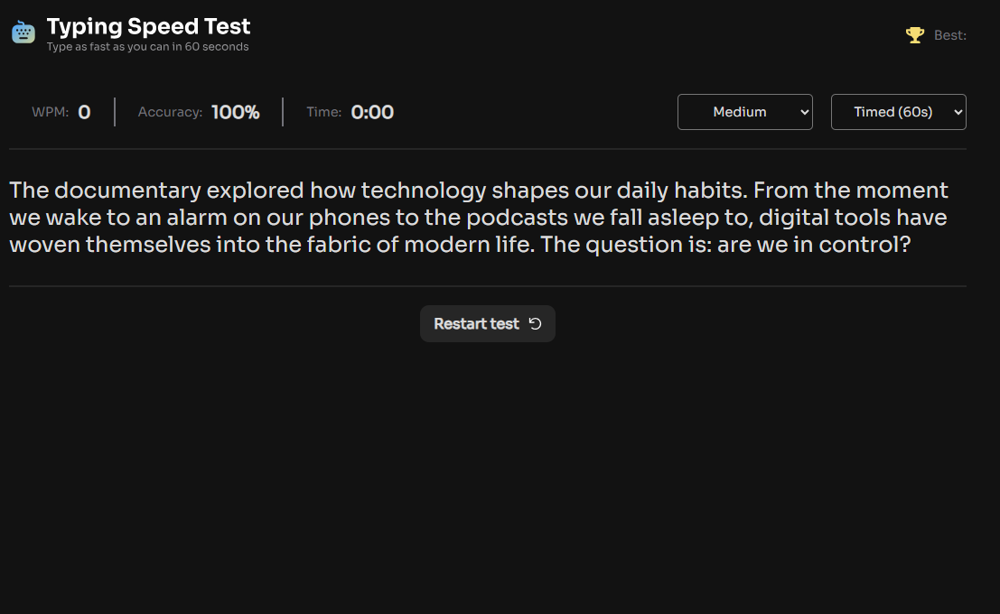

# 📌 Typing Speed Test

Aplicação desenvolvida em React para treinar velocidade e precisão de digitação, com diferentes níveis de dificuldade, estatísticas em tempo real (WPM e acurácia) e sistema de recordes.

<br>

## 🚀 Tecnologias utilizadas

* HTML 5
* CSS 3
* TypeScript

<br>

## 🎯 Funcionalidades

* [ ] Escolha entre diferentes níveis de dificuldade.
* [ ] Geração dinâmica de textos para digitação.
* [ ] Contagem regressiva e controle de tempo da partida.
* [ ] Cálculo em tempo real de Words Per Minute (WPM).
* [ ] Cálculo da precisão (accuracy) durante a digitação.
* [ ] Destaque visual para caracteres corretos e incorretos.
* [ ] Registro e exibição do melhor desempenho do usuário.
* [ ] Reinício rápido da partida sem recarregar a página.
* [ ] Interface responsiva para diferentes tamanhos de tela.

<br>

## 📸 Preview



<br>

## 👤 Como interagir com o projeto

Acesse o [Link](https://andressatomiozzo.github.io/typing-speed-test/)

<br>

## ⚙️ Como rodar o projeto

```bash
# Clonar o repositório
git clone https://github.com/andressatomiozzo/typing-speed-test.git

# Instalar dependências
npm install

# Rodar o projeto
npm run dev
```

<br>

## 🧠 Aprendizados

* Manipulação de eventos de teclado e inputs controlados.
* Organização de código
* Atualização dinâmica da interface

<br>

## 🛠️ Melhorias futuras

* [ ] Refazer em React.
* [ ] Sistema de autenticação de usuários.
* [ ] Ranking global com armazenamento em banco de dados.
* [ ] Histórico de partidas e evolução do desempenho.
* [ ] Suporte a múltiplos idiomas.
* [ ] Modo multiplayer em tempo real.
* [ ] Estatísticas e gráficos de progresso.

<br>

## 🙋‍♀️ Autora

Feito por Andressa Tomiozzo 💙
[LinkedIn](https://www.linkedin.com/in/andressa-tomiozzo/)